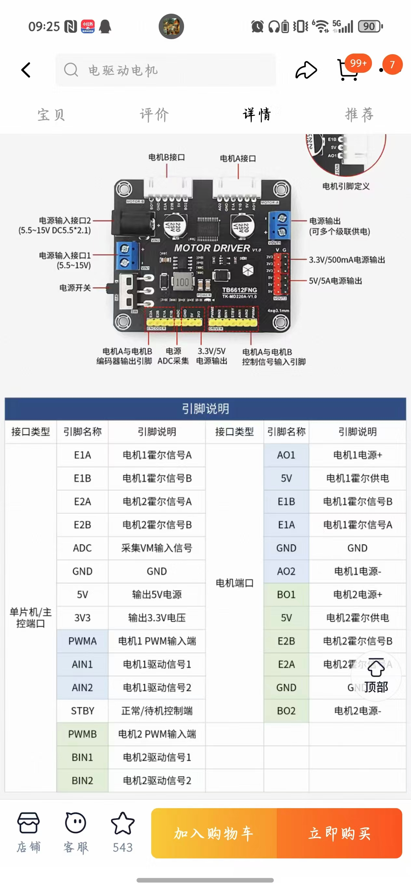

# STM32F103C8T6 + TB6612 + 编码器 + 七路循迹小车

基于 STM32CubeMX 生成的 Makefile 工程，使用 TB6612 驱动两路直流减速电机，电机带 AB 相编码器，支持 Ozone 在线调试。

## 功能

- 两路直流电机控制
- 编码器测速闭环
- 七路数字循迹输入
- Ozone 实时观察和修改参数

## PID 调试整体思路

这辆车的控制不是只有一个 PID，而是分成两层：**底层是左右电机速度 PID**，**上层是循迹 PID**。调试时一定要先把底层调好，再调上层。原因很简单：循迹 PID 只是根据黑线位置计算“左轮应该快一点，还是右轮应该快一点”，但真正让轮子达到目标速度的是电机速度 PID。如果电机速度 PID 没调好，循迹 PID 算得再正确，轮子也执行不到位，车还是会冲出线、左右摆或者转弯慢。

第一步先调循迹模块输入，不让车动。目的是确认七路传感器的接线、电平和左右方向都对。Ozone 里先把 `g_car.mode` 设成 `0`，让车停止，然后观察 `g_line.active_mask`、`g_line.error`、`g_line.line_seen`。黑线从左到右移动时，`g_line.error` 应该从正数逐渐变到 `0`，再变成负数。当前工程的定义是 `S1=50`、`S4=0`、`S7=-50`。如果白底触发、黑线不触发，就要改 `g_line.active_low`。这一步的目的不是调 PID，而是保证 PID 的输入是正确的。

第二步调电机方向和编码器方向。把车架空，进入速度 PID 模式 `g_car.mode = 2`，给左右轮一个小目标速度，例如 `target_counts = 10`。这时轮子应该向前转，`measured_counts` 也应该是正数。如果轮子方向反了，就改 `invert_motor`；如果轮子向前转但 `measured_counts` 是负数，就改 `invert_encoder`。这一关必须先过，因为后面循迹时所有“左轮快、右轮慢”的判断都依赖方向正确。

第三步调左右电机速度 PID。这个 PID 的目标是让 `measured_counts` 跟上 `target_counts`。比如设置 `target_counts = 10`，理想情况下 `measured_counts` 应该稳定在 `8~12` 左右。调的时候先看 `pwm_output` 有没有输出，再看编码器反馈是否跟随。如果响应很慢，优先增大电机 PID 的 `kp`；如果一直差一点达不到目标，再适当调 `ki`；如果速度上下跳或轮子忽快忽慢，再少量加 `kd` 或降低 `kp`。这一步的目的，是让左右轮都能稳定、快速地执行目标速度。

第四步才调循迹 PID。循迹 PID 不直接输出 PWM，它输出的是 `correction_counts`，再由代码计算左右轮目标速度：

```c
left_target_counts  = base_counts - correction_counts
right_target_counts = base_counts + correction_counts
```

其中 `base_counts` 是基础前进速度，`correction_counts` 是根据 `g_line.error` 算出来的修正量。黑线在左边时，`error` 为正，右轮目标速度会变大，车向左修正；黑线在右边时，`error` 为负，左轮目标速度会变大，车向右修正。调循迹 PID 时先低速，例如 `base_counts = 8~10`，`ki` 先保持 `0`，主要调 `kp` 和 `kd`。`kp` 决定转向修正力度，太小转不过弯，太大会左右摆；`kd` 用来抑制来回摆动；`output_limit` 限制最大修正量，太小急弯转不过去，太大可能动作过猛。

调好一档速度后，如果觉得车太慢，不需要从零重新调，但也不能一次加太多。应该小步提高 `base_counts`，例如 `8 -> 10 -> 12 -> 15 -> 26`。每提高一档，都要重新观察 `measured_counts` 能不能跟上、直道会不会摆、弯道会不会冲出去。如果加速后电机速度跟不上，要回去调电机速度 PID；如果电机跟得上但弯道冲出去，调循迹 PID 的 `kp`、`kd` 和 `output_limit`。所以最终顺序可以记成：**先确认传感器，再确认方向，再调电机速度 PID，最后调循迹 PID；提速时小步增加速度，每一步都验证底层速度和上层循迹。**

## 硬件接线

### TB6612

| TB6612 | STM32F103C8T6 | 说明 |
|---|---|---|
| `PWMA` | `PA6` | A 路 PWM |
| `AIN1` | `PA4` | A 路方向 1 |
| `AIN2` | `PA5` | A 路方向 2 |
| `STBY` | `PA3` | 使能，高电平工作 |
| `PWMB` | `PA7` | B 路 PWM |
| `BIN1` | `PB1` | B 路方向 1 |
| `BIN2` | `PB0` | B 路方向 2 |
| `GND` | `GND` | 必须共地 |
| `VIN/DC+` | 电机电源 | 不接 STM32 供电 |


### 编码器

| 编码器 | STM32F103C8T6 | 说明 |
|---|---|---|
| `E1A` | `PA8` | TIM1 编码器 A |
| `E1B` | `PA9` | TIM1 编码器 B |
| `E2A` | `PA0` | TIM2 编码器 A |
| `E2B` | `PA1` | TIM2 编码器 B |

### 七路循迹模块

当前工程的接线顺序是从左到右：

| 传感器位置 | 逻辑名 | STM32 引脚 |
|---|---|---|
| 最左 | `S1 / TRACK1` | `PB9` |
| 左二 | `S2 / TRACK2` | `PB8` |
| 左三 | `S3 / TRACK3` | `PB7` |
| 中间 | `S4 / TRACK4` | `PB6` |
| 右三 | `S5 / TRACK5` | `PB5` |
| 右二 | `S6 / TRACK6` | `PB4` |
| 最右 | `S7 / TRACK7` | `PB3` |

循迹输入在代码里配置成了**上拉输入**。

## 软件模式

`g_car.mode` 的含义：

```c
0 = CAR_MODE_DISABLED   // 停车
1 = CAR_MODE_OPEN_LOOP  // 开环 PWM
2 = CAR_MODE_SPEED_PID  // 电机速度 PID
3 = CAR_MODE_LINE_FOLLOW // 七路循迹
```

## 主要全局变量

### `g_car`

`g_car` 是整车控制结构体，方便 Ozone 直接查看和修改。

#### 总体字段

- `g_car.mode`：当前模式
- `g_car.control_tick`：TIM4 控制周期计数，10ms 加 1
- `g_car.driver_enabled`：TB6612 是否使能

#### 左右电机字段

每个电机都有一套相同字段：

- `pid.kp`：比例系数
- `pid.ki`：积分系数
- `pid.kd`：微分系数
- `pid.integral`：积分累计值
- `pid.previous_error`：上一次误差
- `pid.output_limit`：PID 输出限幅
- `pid.integral_limit`：积分限幅
- `target_counts`：目标编码器增量，单位是每 10ms 的计数
- `measured_counts`：实际编码器增量，单位同上
- `encoder_delta`：本周期编码器变化
- `encoder_total`：累计编码器计数
- `encoder_raw`：原始计数器值
- `encoder_last`：上次计数器值
- `manual_pwm`：开环 PWM
- `pwm_output`：最终 PWM 输出
- `invert_motor`：电机方向是否反转
- `invert_encoder`：编码器方向是否反转

#### 循迹字段

- `g_car.line.pid.kp`：循迹比例系数
- `g_car.line.pid.ki`：循迹积分系数
- `g_car.line.pid.kd`：循迹微分系数
- `g_car.line.pid.output_limit`：循迹修正量限幅
- `g_car.line.base_counts`：基础前进速度
- `g_car.line.correction_counts`：循迹修正量
- `g_car.line.left_target_counts`：左轮目标速度
- `g_car.line.right_target_counts`：右轮目标速度
- `g_car.line.line_lost_stop`：丢线后是否停车

## `target_counts` 从哪里来

`target_counts` 不是随便填的 PWM，也不是电压。它表示**一个控制周期内希望编码器增加多少个计数**。

本工程控制周期是：

```c
CAR_CONTROL_PERIOD_MS = 10
```

所以：

```c
target_counts = 每 10ms 希望编码器变化的计数
```

例如：

```c
g_car.left.target_counts = 10
```

意思是：希望左轮每 10ms 转出 10 个编码器计数。

因为 1 秒有 100 个 10ms，所以如果：

```c
target_counts = 10
```

大约等于：

```text
10 * 100 = 1000 counts/s
```

如果：

```c
target_counts = 26
```

大约等于：

```text
26 * 100 = 2600 counts/s
```

### `target_counts` 和 PWM 的区别

`target_counts` 是目标速度，`pwm_output` 是控制器算出来的电机输出。

关系是：

```text
target_counts -> PID -> pwm_output -> 电机转动 -> 编码器反馈 measured_counts
```

所以设置了 `target_counts` 不代表轮子一定会立刻转。必须满足：

- `g_car.mode = 2` 或 `g_car.mode = 3`
- `driver_enabled = 1`
- `pwm_output` 有输出
- 电机真的转起来
- 编码器真的有计数变化

`measured_counts` 才会跟着变化。

### 怎么找一个合适的 `target_counts`

推荐用开环 PWM 先测。

1. 架空小车
2. 设置开环模式：

```c
g_car.mode = 1
g_car.left.manual_pwm = 300
g_car.right.manual_pwm = 300
```

3. 看实际编码器速度：

```c
g_car.left.measured_counts
g_car.right.measured_counts
```

假设看到左轮大约是：

```c
g_car.left.measured_counts = 12
```

右轮大约是：

```c
g_car.right.measured_counts = 11
```

那说明这个车在这个 PWM 下，大概能跑到每 10ms 十几个计数。

调速度 PID 时就可以先用：

```c
g_car.left.target_counts = 10
g_car.right.target_counts = 10
```

### 为什么一开始常用 `10`

因为 `10 counts / 10ms` 是一个比较低的测试速度。

它的好处是：

- 电机容易看出是否转动
- 速度不会太快
- 方便判断编码器方向
- 方便调 PID

如果你的车很慢，可以从 `5` 开始。  
如果你的车很快，可以从 `10` 或 `15` 开始。

### 循迹模式下 `target_counts` 怎么来的

在循迹模式 `g_car.mode = 3` 下，不需要你直接设置左右轮的 `target_counts`。代码会自动计算：

```c
correction = line_pid(g_line.error)

left_target_counts  = base_counts - correction
right_target_counts = base_counts + correction
```

其中：

```c
g_car.line.base_counts
```

就是基础前进速度。

例如：

```c
g_car.line.base_counts = 10
g_car.line.correction_counts = 4
```

则：

```c
g_car.line.left_target_counts = 6
g_car.line.right_target_counts = 14
```

然后代码会把它们写到：

```c
g_car.left.target_counts
g_car.right.target_counts
```

所以循迹时真正的速度来源是：

```text
base_counts + line PID correction
```

### 怎么判断 `target_counts` 设得合不合适

看：

```c
g_car.left.target_counts
g_car.left.measured_counts
g_car.right.target_counts
g_car.right.measured_counts
```

如果：

```text
target_counts = 10
measured_counts = 8 ~ 12
```

说明这个速度目标比较合适。

如果：

```text
target_counts = 10
measured_counts 一直是 0
```

说明车没有实际转起来，先查：

- `g_car.mode`
- `g_car.driver_enabled`
- `g_car.left/right.pwm_output`
- TB6612 电源
- 电机接线
- 编码器接线

如果：

```text
target_counts = 30
measured_counts 只能到 12
```

说明目标速度太高，当前电机、电源或 PWM 输出达不到。此时不要继续调循迹，先降低目标速度或检查电机驱动能力。

### 调试时推荐的目标值

电机速度 PID 阶段：

```c
target_counts = 5 -> 10 -> 15 -> 20
```

循迹阶段：

```c
base_counts = 6 -> 8 -> 10 -> 12 -> 15
```

每提高一次速度，都要重新观察：

- `measured_counts` 能不能跟上
- 车会不会左右摆
- 转弯会不会冲出线

### 调好后速度太慢，怎么加速

不用每次都从零开始重调，但也不能一次把速度加很多。

提速顺序：

1. 先确认当前速度已经稳定循迹
2. 小幅增加 `g_car.line.base_counts`
3. 看电机速度内环能不能跟上
4. 看循迹转弯会不会冲出线
5. 根据现象微调循迹 PID

例如当前稳定参数是：

```c
g_car.line.base_counts = 8
g_car.line.pid.kp = 0.25
g_car.line.pid.kd = 0.02
g_car.line.pid.output_limit = 16
```

不要直接改到：

```c
g_car.line.base_counts = 20
```

建议这样加：

```c
8 -> 10 -> 12 -> 15
```

每加一档，都看：

```c
g_car.left.target_counts
g_car.left.measured_counts
g_car.right.target_counts
g_car.right.measured_counts
g_car.line.correction_counts
```

如果加速后 `measured_counts` 能跟上，但车转弯冲出线，说明循迹修正不够：

- 适当增大 `g_car.line.pid.kp`
- 适当增大 `g_car.line.pid.output_limit`
- 必要时加一点 `g_car.line.pid.kd`

如果加速后 `target_counts` 变大了，但 `measured_counts` 跟不上，说明电机速度 PID 或电机驱动能力不够：

- 先调电机速度 PID 的 `kp`
- 检查 `pwm_output` 是否长期接近最大值
- 如果 PWM 已经顶满，说明硬件速度上不去，不要继续加 `base_counts`

如果加速后左右摆动变大：

- 先适当减小 `g_car.line.pid.kp`
- 加一点 `g_car.line.pid.kd`
- 或者把 `base_counts` 降回上一档

提速的原则是：

```text
每次只加一点速度，每加一次都确认“电机跟得上、循迹不冲线、直道不乱摆”。
```

如果只是从 `base_counts = 8` 加到 `10`，通常不需要从头重调，只需要微调。  
如果从 `8` 加到 `20`，车的动态变化会很大，基本等于要重新调一遍。

### `g_line`

`g_line` 是七路循迹读取结果。

- `raw_mask`：原始电平位图
- `active_mask`：有效触发位图
- `active_count`：触发了几路
- `line_seen`：是否检测到黑线
- `active_low`：黑线触发电平设置
- `position`：当前线位置
- `error`：当前循迹误差
- `sample_tick`：采样计数
- `right_angle_enable`：是否启用直角弯增强识别
- `right_angle_detected`：是否检测到直角弯
- `right_angle_direction`：直角弯方向，`1` 为左直角，`-1` 为右直角
- `right_angle_error`：直角弯增强时强制使用的误差值

`active_low` 的含义：

| `g_line.active_low` | 含义 |
|---:|---|
| `0` | GPIO 高电平算检测到黑线 |
| `1` | GPIO 低电平算检测到黑线 |

本工程当前默认是：

```c
g_line.active_low = 0
```

## `g_line.error` 含义

当前定义是：

| 传感器 | 引脚 | `active_mask` | `g_line.error` |
|---|---|---:|---:|
| `S1` 最左 | `PB9` | `1` | `50` |
| `S2` | `PB8` | `2` | `33` |
| `S3` | `PB7` | `4` | `16` |
| `S4` 中间 | `PB6` | `8` | `0` |
| `S5` | `PB5` | `16` | `-16` |
| `S6` | `PB4` | `32` | `-33` |
| `S7` 最右 | `PB3` | `64` | `-50` |

也就是：

- 黑线在左边，`error` 为正
- 黑线在中间，`error` 接近 0
- 黑线在右边，`error` 为负

如果只压住一个探头，`active_mask` 应该等于表里的值。如果黑线压在两个探头中间，`active_mask` 会相加，`error` 会取平均值。

例如 `S4 + S5` 同时触发：

```c
g_line.active_mask = 24  // 8 + 16
g_line.error       = -8  // (0 + -16) / 2
```

## Ozone 调试顺序

### 1. 先确认程序在跑

先看：

```c
g_car.control_tick
g_line.sample_tick
```

正常现象：

- 两个值一直增加
- `control_tick` 大约每秒增加 100

如果不增加，先检查工程是否正常下载运行。

这一关通过标准：

- `g_car.control_tick` 不停止
- `g_line.sample_tick` 不停止
- Ozone 没有停在 HardFault 或 Error_Handler

### 2. 先让车不动

把模式改成：

```c
g_car.mode = 0
```

再看：

```c
g_car.driver_enabled
g_car.left.pwm_output
g_car.right.pwm_output
```

正常现象：

- `driver_enabled = 0`
- `pwm_output = 0`

这一关通过标准：

- 轮子不转
- TB6612 的 `STBY` 被拉低
- 左右 PWM 都是 0

### 3. 先测循迹输入

看：

```c
g_line.active_low
g_line.raw_mask
g_line.active_mask
g_line.active_count
g_line.line_seen
g_line.error
g_line.position
```

正常现象：

- 白底时不触发
- 黑线压到某个探头时，对应位会变化
- `g_line.error` 会按左正右负变化

如果白底触发、黑线不触发，说明黑白电平反了。切换：

```c
g_line.active_low = 0 或 1
```

这一关通过标准：

- 白底时 `g_line.line_seen = 0`
- 黑线压到 S1 时 `g_line.error = 50`
- 黑线压到 S4 时 `g_line.error = 0`
- 黑线压到 S7 时 `g_line.error = -50`
- 黑线从左到右移动时，`error` 从正数逐渐变到 0，再变成负数

### 4. 再测电机速度 PID

这一层是底座，不是可有可无。循迹外环只负责决定左右轮要快还是慢，真正把轮子带起来的是这里的速度 PID。

架空小车，设置：

```c
g_car.mode = 2
g_car.left.target_counts = 10
g_car.right.target_counts = 10
```

看：

```c
g_car.left.measured_counts
g_car.right.measured_counts
g_car.left.pwm_output
g_car.right.pwm_output
g_car.left.pid.kp
g_car.left.pid.ki
g_car.left.pid.kd
g_car.left.pid.integral
g_car.left.pid.previous_error
g_car.left.pid.output_limit
g_car.right.pid.kp
g_car.right.pid.ki
g_car.right.pid.kd
g_car.right.pid.integral
g_car.right.pid.previous_error
g_car.right.pid.output_limit
```

### 电机速度 PID 参数什么意思

#### `g_car.left/right.pid.kp`

比例系数。误差一出现，输出就跟着变。

- 太小：轮子反应慢，目标给了半天还追不上
- 太大：速度容易抖，PWM 上下跳

#### `g_car.left/right.pid.ki`

积分系数。用来补长期误差。

- 太小：轮子可能一直差一点点上不去
- 太大：容易越积越多，最后冲过头

你现在这版默认 `ki = 0.47`，是为了让轮子能慢慢追到目标速度。

#### `g_car.left/right.pid.kd`

微分系数。用来压速度波动。

- 太小：速度起伏大
- 太大：输出会变得很敏感

#### `g_car.left/right.pid.integral`

积分累加值。

- 如果它一直涨，但速度还跟不上，说明输出不够或者机械负载太大

#### `g_car.left/right.pid.previous_error`

上一次误差。

- 一般不用手动改
- 主要是判断 PID 是否在正常更新

#### `g_car.left/right.pid.output_limit`

PID 输出限幅。

- 太小：电机想加速也加不上去
- 太大：容易冲过头

#### `g_car.left/right.target_counts`

目标速度，单位是“每 10ms 的编码器计数”。

#### `g_car.left/right.measured_counts`

实际速度，单位同上。

这是最重要的观察值。

### 电机速度 PID 怎么调

推荐顺序：

1. 先把左右轮都架空
2. 先给一个低目标值，比如 `10`
3. 看 `measured_counts` 能不能跟上 `target_counts`
4. 如果跟得慢，先加 `kp`
5. 如果还有长期偏差，再加一点 `ki`
6. 如果速度抖得厉害，再少量加 `kd`

建议起步：

```c
g_car.left.pid.kp = 5 ~ 30
g_car.left.pid.ki = 0.1 ~ 0.6
g_car.left.pid.kd = 0 ~ 1
g_car.left.pid.output_limit = 500 ~ 3199

g_car.right.pid.kp = 5 ~ 30
g_car.right.pid.ki = 0.1 ~ 0.6
g_car.right.pid.kd = 0 ~ 1
g_car.right.pid.output_limit = 500 ~ 3199
```

你现在默认 `kp = 0`，`ki = 0.47`，`kd = 0`，意思是：

- 靠积分慢慢把速度拉上去
- 响应会比较稳，但不一定最快

### 电机速度 PID 的判断标准

#### 可以了

- `target_counts = 10` 时，`measured_counts` 能稳定跟到 `8 ~ 12`
- 左右轮都能转
- `pwm_output` 不会长期顶死在最大值
- 目标变化后，实际速度会跟着变化

#### 跟不上

- `measured_counts` 长期低于 `target_counts`
- `pwm_output` 很大，但速度还是上不去

先调：

- 增大 `kp`
- 适当增大 `output_limit`
- 再慢慢补一点 `ki`

#### 太慢

- 轮子能动，但反应肉

先调：

- 增大 `kp`
- 检查 `output_limit`

#### 抖动

- `measured_counts` 上下跳
- 轮子忽快忽慢

先调：

- 减小 `kp`
- 适当加一点 `kd`
- 不要把 `ki` 拉太大

正常现象：

- 两个轮子都向前转
- `measured_counts` 接近 `target_counts`
- 左右轮都能跟住低速目标
- 改变 `target_counts` 后，`measured_counts` 会跟着变化

如果方向反了，调：

- `invert_motor`
- `invert_encoder`

这一关通过标准：

- `target_counts` 是正数时，轮子向前转
- `measured_counts` 也是正数
- `target_counts = 10` 时，`measured_counts` 能稳定在大约 `8 ~ 12`
- 左右轮差距不要太大

### 5. 最后测循迹

先架空测试：

```c
g_car.mode = 3
g_car.line.base_counts = 10
g_car.line.pid.kp = 0.25
g_car.line.pid.ki = 0
g_car.line.pid.kd = 0
g_car.line.pid.output_limit = 20
g_car.line.line_lost_stop = 1
```

看：

```c
g_car.line.correction_counts
g_car.line.left_target_counts
g_car.line.right_target_counts
g_car.left.target_counts
g_car.right.target_counts
```

正常现象：

- 黑线在左边时，右轮目标速度更大
- 黑线在右边时，左轮目标速度更大
- 黑线在中间时，左右目标速度接近

这一关通过标准：

- `S1` 触发时，`right_target_counts > left_target_counts`
- `S4` 触发时，左右目标速度接近
- `S7` 触发时，`left_target_counts > right_target_counts`
- 如果方向反了，先检查 `g_line.error` 方向，再检查循迹修正方向

## Ozone Data 图像观察

Ozone 不只能看变量数值，也可以把变量加入 Data 窗口画曲线。调 PID 时，曲线比单个数字更直观，因为 PID 调得好不好主要看“响应过程”：有没有跟上、有没有过冲、有没有抖动、有没有长期偏差。

### 程序是否正常运行

建议画：

```c
g_car.control_tick
g_line.sample_tick
```

正常图像：

- 两条曲线都持续上升
- 不会突然停止

异常图像：

- 曲线停止不动：程序停住了，可能进了 HardFault、Error_Handler，或者 Ozone 暂停了 CPU
- `control_tick` 增加但 `sample_tick` 不增加：循迹读取没有正常执行

### 循迹输入图像

建议画：

```c
g_line.error
g_line.active_count
g_line.line_seen
g_line.active_mask
```

正常图像：

- 黑线在中间时，`g_line.error` 接近 `0`
- 黑线往左偏时，`g_line.error` 变成正数
- 黑线往右偏时，`g_line.error` 变成负数
- 有黑线时，`g_line.line_seen = 1`
- 白底或丢线时，`g_line.line_seen = 0`

调好标准：

- 黑线从左到右移动时，`error` 曲线能按 `50 -> 33 -> 16 -> 0 -> -16 -> -33 -> -50` 的方向变化
- `active_count` 和实际压住的探头数量一致
- `active_mask` 和实际探头位置一致

异常图像：

- 白底时 `line_seen` 一直为 `1`：黑白电平可能反了，检查 `g_line.active_low`
- 黑线移动时 `error` 方向反了：S1~S7 接线顺序或权重方向有问题
- `error` 大幅乱跳：传感器离地高度、黑线宽度、光照或接线可能有问题

### 电机速度 PID 图像

建议左轮画一组：

```c
g_car.left.target_counts
g_car.left.measured_counts
g_car.left.pwm_output
```

右轮画一组：

```c
g_car.right.target_counts
g_car.right.measured_counts
g_car.right.pwm_output
```

正常图像：

- `target_counts` 是目标线
- `measured_counts` 应该跟着 `target_counts` 走
- `pwm_output` 起步时会变大，速度接近目标后会回落到稳定值

调好标准：

- `target_counts = 10` 时，`measured_counts` 能稳定在 `8 ~ 12`
- 改变 `target_counts` 后，`measured_counts` 能较快跟上
- `measured_counts` 不长期为 0
- `pwm_output` 不长期顶在最大值
- 左右轮的 `measured_counts` 不应差太多

异常图像和原因：

- `target_counts` 有值，但 `measured_counts = 0`：电机没转、编码器没反馈、PWM 太小或驱动没使能
- `pwm_output` 很大但 `measured_counts` 上不去：电机驱动能力不够、电池电压低、机械阻力大，或者 PID 输出已经顶满
- `measured_counts` 明显慢慢爬上去：响应慢，可以增加电机速度 PID 的 `kp`
- `measured_counts` 上下振荡：`kp` 可能太大，或者需要少量 `kd`
- `measured_counts` 稳定低于目标：可以适当增加 `ki`

### 循迹 PID 图像

建议画：

```c
g_line.error
g_car.line.correction_counts
g_car.line.left_target_counts
g_car.line.right_target_counts
g_car.left.measured_counts
g_car.right.measured_counts
```

正常图像：

- `g_line.error` 偏左为正，偏右为负
- `correction_counts` 应跟着 `error` 同方向变化
- 黑线偏左时，`right_target_counts` 高于 `left_target_counts`
- 黑线偏右时，`left_target_counts` 高于 `right_target_counts`
- 黑线回到中间时，左右目标速度重新接近

调好标准：

- 直道时 `error` 在 0 附近小范围变化
- 直道时左右目标速度差不大
- 入弯时 `correction_counts` 能及时增大
- 出弯后 `correction_counts` 能回到接近 0
- 车不会一直左右大幅摆动

异常图像和原因：

- `error` 已经很大，但 `correction_counts` 很小：循迹 `kp` 太小或 `output_limit` 太小
- `correction_counts` 经常顶到 `output_limit`：弯道需求超过当前限幅，或者速度太快
- `correction_counts` 来回大幅正负跳：`kp` 太大，或者传感器输入抖动
- `error` 回到 0 后车还继续甩：`kd` 太小，或者速度太快

### 直角弯图像

建议画：

```c
g_line.active_mask
g_line.right_angle_detected
g_line.right_angle_direction
g_line.error
g_car.line.correction_counts
g_car.line.left_target_counts
g_car.line.right_target_counts
```

正常图像：

- 左直角时，`active_mask` 可能出现 `15`
- 右直角时，`active_mask` 可能出现 `120`
- 触发直角增强时，`right_angle_detected = 1`
- 左直角时，`right_angle_direction = 1`
- 右直角时，`right_angle_direction = -1`
- 直角增强触发后，`g_line.error` 会被增强到 `+50` 或 `-50`

调好标准：

- 直角弯前后 `right_angle_detected` 能短暂变成 `1`
- `correction_counts` 能迅速变大
- 左右目标速度差明显拉开
- 车能转过直角，出弯后 `error` 回到 0 附近

异常图像和原因：

- `active_mask` 到了 `15/120`，但 `right_angle_detected` 没有变成 `1`：检查 `g_line.right_angle_enable`
- `right_angle_detected = 1`，但车还是转不过去：增大 `output_limit`，或降低 `base_counts`
- 直角后左右摆得厉害：适当增加 `kd`，或者减小 `kp`
- 普通曲线变差：可以临时设置 `g_line.right_angle_enable = 0` 对比测试

### 最终算调好的图像状态

可以认为调得比较好了，如果 Data 图像满足这些条件：

- 程序计数曲线持续运行，不会停止
- 传感器 `error` 方向正确，中心附近接近 0
- 电机 `measured_counts` 能跟上 `target_counts`
- 循迹时 `correction_counts` 不会长期顶满
- 直道时 `error` 和 `correction_counts` 小幅波动
- 弯道时 `correction_counts` 能及时增大，出弯后能回落
- 直角弯时 `right_angle_detected` 能触发，车能转过去

## 调参原则

### 先调什么

1. 先调循迹模块电平，确认 `g_line.error` 方向正确
2. 再调电机方向和编码器方向
3. 再调电机速度 PID
4. 最后调循迹 PID

### 速度 PID 怎么看

主要看这些变量：

```c
g_car.left.target_counts
g_car.left.measured_counts
g_car.left.pwm_output
g_car.right.target_counts
g_car.right.measured_counts
g_car.right.pwm_output
```

标准：

- 目标是正数时，轮子向前转
- `measured_counts` 也应该是正数
- 实际值尽量接近目标值
- `pwm_output` 不应该长期顶到最大值
- 调大/调小 `target_counts` 后，`measured_counts` 应该跟着变化

### 循迹 PID 怎么看

看这三个变量：

```c
g_car.line.correction_counts
g_car.line.left_target_counts
g_car.line.right_target_counts
```

标准：

- 线在左边时，右轮更快
- 线在右边时，左轮更快
- 修正量不要太大，也不要太小

## 常见现象和调整方向

### 跟不上线

现象：

- 车转弯太慢
- 黑线已经偏到一边，但车修不回来

先调：

- 增大 `g_car.line.pid.kp`
- 增大 `g_car.line.pid.output_limit`

### 左右大幅摆动

现象：

- 车一直左右甩

先调：

- 减小 `g_car.line.pid.kp`
- 加一点 `g_car.line.pid.kd`
- 适当减小 `g_car.line.base_counts`

### 车很慢但还是反应慢

现象：

- 速度已经不高，但转弯还是跟不上

先查：

- `g_car.line.pid.output_limit` 是否太小
- `g_car.line.pid.kp` 是否太小
- 电机速度 PID 的 `kp` 是否太小

### 能稳定循迹但速度太慢

现象：

- 车能沿线跑
- 直道不摆
- 弯道也能过
- 但是整体速度太慢

先调：

- 小幅增大 `g_car.line.base_counts`
- 每次只加一档，比如 `8 -> 10 -> 12`
- 每次加速后观察 `measured_counts` 是否跟得上

如果加速后冲出线：

- 增大一点 `g_car.line.pid.kp`
- 增大一点 `g_car.line.pid.output_limit`
- 加一点 `g_car.line.pid.kd`

如果加速后左右摆：

- 减小一点 `g_car.line.pid.kp`
- 加一点 `g_car.line.pid.kd`
- 或退回上一档速度

### 曲线能过，但直角转弯过不了

现象：

- 普通弯道可以跟线
- 90 度直角弯会冲出去
- 进入直角弯时，可能是最外侧单个探头触发，也可能是半边多个探头同时触发
- 有时会短暂丢线，`g_line.line_seen = 0`

这说明车对急弯的修正不够，或者速度对于直角弯来说太高。

先看这些变量：

```c
g_line.error
g_line.line_seen
g_car.line.correction_counts
g_car.line.left_target_counts
g_car.line.right_target_counts
g_car.left.measured_counts
g_car.right.measured_counts
```

直角弯常见有两种传感器状态。

第一种，只有最外侧探头压线：

```text
S1 触发 -> g_line.error = 50
S7 触发 -> g_line.error = -50
```

这说明线已经偏到最边上了，车需要很强的修正。

第二种，半边多个探头同时压线：

```text
左直角：S1 + S2 + S3 + S4
右直角：S4 + S5 + S6 + S7
```

当前代码使用的是“触发探头求平均”的算法，所以：

```text
S1 + S2 + S3 + S4:
(50 + 33 + 16 + 0) / 4 = 24

S4 + S5 + S6 + S7:
(0 - 16 - 33 - 50) / 4 = -24
```

也就是说，直角弯时如果半边都压线，`g_line.error` 不一定会到 `50/-50`，它可能只有 `24/-24` 左右。这不是传感器坏了，而是平均算法的结果。

当前代码已经对这种情况做了专门识别：

```text
S1 + S2 + S3 + S4 -> 左直角，g_line.error 强制为 +right_angle_error
S4 + S5 + S6 + S7 -> 右直角，g_line.error 强制为 -right_angle_error
```

默认：

```c
g_line.right_angle_enable = 1
g_line.right_angle_error = 50
```

Ozone 里可以看：

```c
g_line.right_angle_enable
g_line.right_angle_detected
g_line.right_angle_direction
g_line.right_angle_error
```

如果普通曲线都正常，只有直角弯过不去，可以保持 `right_angle_enable = 1`。  
如果打开后普通路线反而变差，可以临时关掉：

```c
g_line.right_angle_enable = 0
```

如果直角弯时 `g_line.error` 只有 `24/-24`，说明没有触发直角增强，先看 `active_mask` 是否真的满足 `S1~S4` 或 `S4~S7`：

```text
S1 + S2 + S3 + S4 -> active_mask = 15
S4 + S5 + S6 + S7 -> active_mask = 120
```

如果直角增强已经触发，但车仍然转不过去，可以再通过 PID 参数补偿：

- 增大 `g_car.line.pid.kp`
- 增大 `g_car.line.pid.output_limit`

如果直角弯时 `g_line.error` 已经到 `50/-50`，但 `correction_counts` 还是不大，也说明循迹修正太小：

- 增大 `g_car.line.pid.kp`
- 增大 `g_car.line.pid.output_limit`

如果 `correction_counts` 已经很大，但车还是转不过去，说明轮子目标速度差还不够大：

- 继续增大 `g_car.line.pid.output_limit`
- 允许一侧轮子变慢，甚至短暂反转
- 适当降低 `g_car.line.base_counts`

例如：

```c
g_car.line.base_counts = 8
g_car.line.pid.kp = 0.30
g_car.line.pid.kd = 0.03
g_car.line.pid.output_limit = 20
```

在 `base_counts = 8`、`output_limit = 20` 时，急弯可能算出类似：

```c
left_target_counts = -12
right_target_counts = 28
```

这表示一侧轮子可以反转，车会更容易急转。但这个动作比较猛，必须先架空测试方向，再低速上地。

如果直角弯时直接丢线：

- 降低 `g_car.line.base_counts`
- 保持 `g_car.line.line_lost_stop = 1`
- 增大一点 `g_car.line.pid.kp`
- 检查循迹模块离地高度和黑线宽度

如果曲线稳定、直角不行，推荐调参顺序：

```c
1. base_counts 先降一档
2. output_limit 加大
3. kp 稍微加大
4. kd 加一点防止转完后左右摆
```

不要只加 `kp`。只加 `kp` 可能会让直道和曲线变得左右摆动，直角还不一定能过。

### 一加速就丢线

现象：

- 直道还行，速度一高就出线

先调：

- 降低 `g_car.line.base_counts`
- 降低 `g_car.line.pid.output_limit`
- 增大一点 `g_car.line.pid.kp`

## 推荐起步参数

### 电机速度 PID

先从当前默认值开始：

```c
g_car.left.pid.kp = 0
g_car.left.pid.ki = 0.47
g_car.left.pid.kd = 0

g_car.right.pid.kp = 0
g_car.right.pid.ki = 0.47
g_car.right.pid.kd = 0
```

如果响应太慢，再慢慢给 `kp`，比如：

```c
g_car.left.pid.kp = 10
g_car.right.pid.kp = 10
```

再根据现象逐步试：

```c
10 -> 20 -> 30
```

如果速度一直差一点上不去，再微调 `ki`。如果速度上下跳，再减小 `kp` 或少量加 `kd`。

### 循迹 PID

建议起步：

```c
g_car.line.base_counts = 8 ~ 10
g_car.line.pid.kp = 0.20 ~ 0.30
g_car.line.pid.ki = 0
g_car.line.pid.kd = 0 ~ 0.05
g_car.line.pid.output_limit = 16 ~ 20
```

## 已调参数记录

### `base_counts = 26` 参数记录

这组参数是当前已经调通后记录下来的，用于后续复现或继续提速。  
如果后面在 Ozone 中继续调参，需要把新的值同步写回代码和这里。

#### 电机速度 PID

```c
g_car.left.pid.kp = 180
g_car.left.pid.ki = 0.35
g_car.left.pid.kd = 26

g_car.right.pid.kp = 180
g_car.right.pid.ki = 0.28
g_car.right.pid.kd = 18
```

#### 电机和编码器方向

```c
g_car.left.invert_motor = 1
g_car.left.invert_encoder = 0

g_car.right.invert_motor = 1
g_car.right.invert_encoder = 1
```

#### 循迹 PID

```c
g_car.line.base_counts = 26
g_car.line.pid.kp = 0.38
g_car.line.pid.ki = 0
g_car.line.pid.kd = 0.2
g_car.line.pid.output_limit = 20
g_car.line.line_lost_stop = 1
```

#### 七路循迹和直角弯增强

```c
g_line.active_low = 0
g_line.right_angle_enable = 1
g_line.right_angle_error = 50
```

#### 启动模式

```c
g_car.mode = 3
```

`g_car.mode = 3` 表示上电后直接进入循迹模式。如果只想上电后停车，需要改成：

```c
g_car.mode = 0
```

## 构建

Makefile 工程直接编译：

```bash
make
```

产物在 `build/` 下：

- `build/car.elf`
- `build/car.hex`
- `build/car.bin`

## 备注

- `Ozone` 改的是 RAM，断电不会保存
- 调好的参数要写回代码
- 上电前确认 STM32 和 TB6612 共地
- 循迹模块电平要和 `g_line.active_low` 一致
